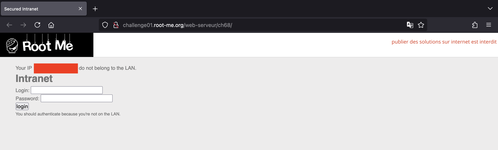
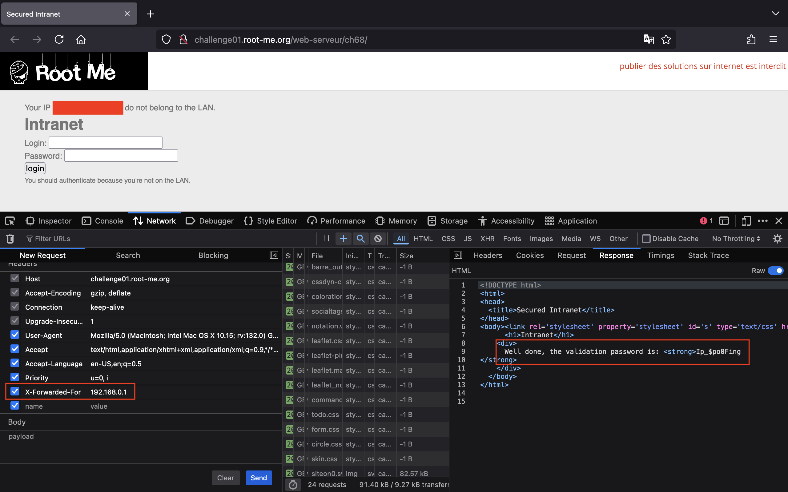

<!-- markdownlint-disable MD033 MD041 -->

<!-- markdownlint-enable MD033 -->

# Root Me

Chào mọi người!

Tại đây, mình sẽ viết lại cách mà mình đã thực hiện để có thể giải được một số thử thách ở trên trang web [Root Me](https://www.root-me.org/).

Cảm ơn vì đã ghé thăm! 🌱

## HTML - Code source

Mở đầu với một thử thách đơn giản, chúng ta sẽ nhấn tổ hợp phím `Command + U` trên Mac (hoặc `Ctrl + U` trên Windows) để có thể xem HTML source code của trang web. Từ đó, chúng ta sẽ lấy được password trong phần comment.

## HTTP - IP Filtering Bypass

Khi bắt đầu thử thách, chúng ta thấy trang web hiện lên thông báo rằng địa chỉ IP của chúng ta không thuộc mạng LAN và yêu cầu xác thực.

Tuy nhiên, sẽ ra sao nếu chúng ta giả mạo địa chỉ IP nội bộ bằng cách thêm vào một request header như `X-Forwarded-For: 192.168.0.1`.
Với trình duyệt Firefox, chúng ta có thể mở Web Developer Tools và sửa đổi request ở tab Network.

Gửi request, chúng ta thấy password xuất hiện.

