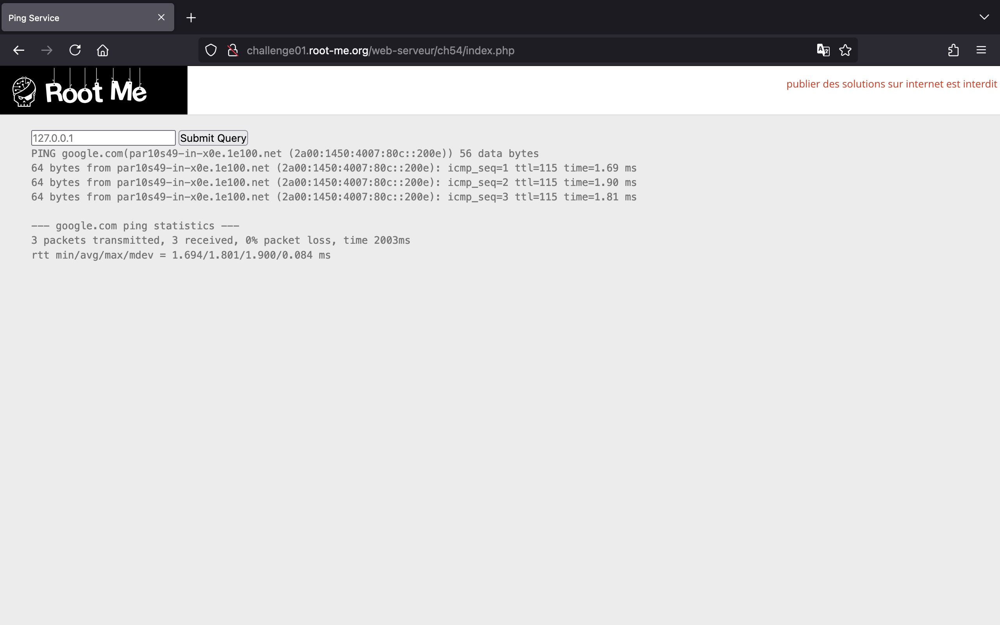
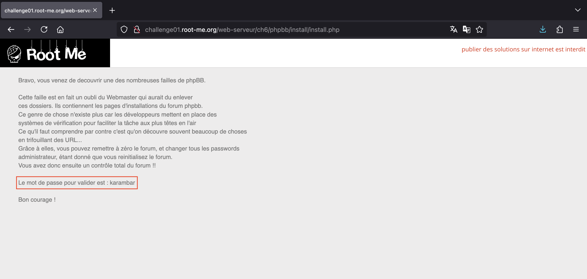

<!-- markdownlint-disable MD033 MD041 -->
<p align="center">
<a href="https://www.root-me.org/"></a>
</p>
<!-- markdownlint-enable MD033 -->

# Root Me

Chào mọi người!

Tại đây, mình sẽ viết lại cách mà mình đã thực hiện để có thể giải được một số thử thách ở trên trang web [Root Me](https://www.root-me.org/).

Cảm ơn vì đã ghé thăm! 🌱

## HTML - Source code

> Don't search too far

Mở đầu với một thử thách đơn giản, chúng ta sẽ nhấn tổ hợp phím `Command + U` trên Mac (hoặc `Ctrl + U` trên Windows) để có thể xem HTML source code của trang web. Từ đó, chúng ta sẽ lấy được password trong phần comment.


## HTTP - IP restriction bypass

> Only local users will be able to access the page
>
> Dear colleagues,
>
> We’re now managing connections to the intranet using private IP addresses, so it’s no longer necessary to login with a username / password when you are already connected to the internal company network.
>
> Regards,
>
> The network admin

Khi bắt đầu thử thách, chúng ta thấy trang web hiện lên thông báo rằng địa chỉ IP của chúng ta không thuộc mạng LAN và yêu cầu xác thực.


Tuy nhiên, sẽ ra sao nếu chúng ta giả mạo địa chỉ IP nội bộ bằng cách thêm vào một request header như `X-Forwarded-For: 192.168.0.1`.
Với trình duyệt Firefox, chúng ta có thể mở Web Developer Tools và sửa đổi request ở tab Network.

Gửi request, chúng ta thấy password xuất hiện.


## HTTP - Open redirect

> Internet is so big
>
> Find a way to make a redirection to a domain other than those showed on the web page.

Một trang web giản đơn với 3 nút Facebook, Twitter và Slack.


Nếu chúng ta nhấn chọn 1 trong 3 nút này sẽ được điều hướng tới trang web tương ứng. Bên dưới là request khi chúng ta nhấn vào nút Facebook.


Có thể thấy phần query string được thêm vào URL, nó có 2 tham số là `url` và `h`. Thực hiện điều hướng sử dụng `document.location`.

Điểm đáng chú ý là tham số `h` chứa giá trị MD5 hash của giá trị trong `url`. Chúng ta dễ dàng kiểm tra được nhờ sử dụng [Hash text - IT tools](https://it-tools.tech/hash-text).


Vậy, thử đổi `https://facebook.com` thành một giá trị bất kỳ, ví dụ như số `1`. Ngay lập tức, chúng ta nhận được một thông báo lỗi "Incorrect hash!".


Điều đó chứng tỏ rằng ở phía server đang thực hiện tính toán MD5 hash giá trị của tham số `url` và so sánh nó với hash nằm ở tham số `h`. Nếu đúng mới trả về thẻ `<script>`.

Vậy nên chúng ta cần tính giá trị MD5 hash của `1` để truyền vào tham số `h`.


Có lẽ server kiểm tra nếu giá trị của `url` không phải là 1 trong 3 URLs tới Facebook, Twitter, Slack và giá trị hash hợp lệ thì trả về flag cho chúng ta.


## HTTP - User-agent

> Admin is really dumb...

Trang web thông báo user-agent của chúng ta không phải là admin.


Do vậy, chúng ta chỉ cần sửa giá trị của header `User-Agent` thành `admin` và gửi request là có được password.


## Weak password

> Nothing too difficult

Trang web yêu cầu chúng ta đăng nhập.


Như tên thử thách, chúng ta có thể thử đăng nhập với tài khoản và mật khẩu dễ đoán. Tại đây, đăng nhập với `admin:admin` chúng ta được phép truy cập trang web.


## PHP - Command injection

> Ping service v1
>
> Find a vulnerabilty in this service and exploit it.
>
> You must manage to read index.php

Theo như tên của thử thách cùng với mô tả, chúng ta biết rằng trang web này dính lỗ hổng OS Command Injection và chúng ta cần đọc file `index.php`.

Trang web cho phép chúng ta nhập vào ip sau đó nó sẽ thực hiện câu lệnh `ping` tới ip đó.



Chúng ta có thể sử dụng [Burp Suite](https://portswigger.net/burp) để chỉnh sửa request cũng như quan sát response dễ dàng hơn.

Chúng ta sẽ dùng dấu `;` để thực thi được liên tiếp các lệnh. Với payload `; ls`, chúng ta xác định được có file `index.php` ở thư mục hiện tại.


Và để đọc nội dung của file `index.php`, chúng ta có thể dùng payload `; cat index.php`.


Vậy là flag ở trong file `.passwd`, chúng ta dùng payload `; cat .passwd` để lấy flag.


## API - Broken Access

> Follow the Swagger!
>
> Your friend has set up a platform where you can register and post a private note. Everything is based on an API. Before setting up the Front-End, he asked you to check that everything was secure.

Truy cập vào trang chủ, chúng ta thấy giao diện API Documentation được tạo ra bằng Swagger. Nó giúp chúng ta dễ dàng biết và sử dụng được các chức năng mà API cung cấp.


Trước tiên, tạo một tài khoản tại endpoint `/api/signup`.


Tạo tài khoản thành công, chúng ta thực hiện đăng nhập tại endpoint `/api/login`. Để ý được cấp cookie `session`, chúng ta sẽ dùng cookie này để có quyền truy cập vào 2 endpoints còn lại.


Tại endpoint `/api/note`, chúng ta có chức năng cập nhật note.


Và với endpoint cuối cùng `/api/user`, chúng ta xem được 3 thông tin là `note`, `userid` và `username`.

Tuy nhiên, điểm đáng chú ý tại endpoint này là `userid` có giá trị là `2`. Vậy người dùng với `userid` là `1` sẽ là ai?


Thông thường, chúng ta có thể xem thông tin người dùng theo id nên thử thêm `/1` vào endpoint `/api/user`.

Thành công, chúng ta đã xem được note chứa flag của người dùng `admin`.


## Backup file

> No clue.

Thử thách này yêu cầu chúng ta đăng nhập nhưng chúng ta đâu có biết thông tin đăng nhập.


Với tên thử thách liên quan đến backup file, có thể nghĩ đến việc đọc các file này để tìm được các thông tin hữu ích.

Chúng ta sẽ sử dụng công cụ [dirsearch](https://github.com/maurosoria/dirsearch) với wordlist [backup_files_only.txt](https://github.com/xajkep/wordlists/blob/master/discovery/backup_files_only.txt) để thực hiện fuzz tìm file backup.

```bash
python3 dirsearch.py -w ~/wordlists/backup_files_only.txt -u http://challenge01.root-me.org/web-serveur/ch11/
```

Sau khi thực hiện lệnh trên, chúng ta nhận thấy server có một file `index.php~`.

```text
[11:23:48] 200 -   843B - /web-serveur/ch11/index.php~
```

Tiếp theo, chúng ta sẽ lấy nội dung của file đó bằng lệnh `curl`.

```bash
curl http://challenge01.root-me.org/web-serveur/ch11/index.php~
```

```php
<?php

$username="ch11";
$password="OCCY9AcNm1tj";
...
```

Có được username cùng với password, chúng ta có thể đăng nhập thành công.


## HTTP - Directory indexing

> CTRL+U...

Khi truy cập trang web, chúng ta sẽ chẳng thấy gì. Tuy nhiên, nếu chúng ta xem HTML source của trang sẽ thấy một phần comment thú vị.


Theo đường dẫn tới file `pass.html` cũng không có password cho chúng ta.


Nhưng sẽ ra sao nếu chúng ta chỉ vào `admin`?

Bùm! Chúng ta thấy file và thư mục trong folder `admin`. Đáng chú ý là có một thư mục `backup`.


Và khi truy cập thư mục `backup`, chúng ta thấy có file `admin.txt`.


Cuối cùng, truy cập vào file `admin.txt`, chúng ta sẽ lấy được password.


## HTTP - Headers

> HTTP response give informations
>
> Get an administrator access to the webpage.

Truy cập vào thử thách, chúng ta thấy một dòng chữ bảo rằng nội dung của trang web không phải là phần duy nhất ở trong HTTP response:


Nếu chúng ta quan sát response trong Burp Suite sẽ thấy có header `Header-RootMe-Admin`:


Vậy, chúng ta sẽ thêm header đó vào trong request để nhận được password:


## HTTP - POST

> Do you know HTTP?
>
> Find a way to beat the top score!

Thử thách này yêu cầu chúng ta phải có score lớn hơn `999999` mới lấy được flag.


Khi nhấn "Give a try!", chúng ta sẽ có một score ngẫu nhiên nhỏ hơn `999999` và chúng ta thua.


Bên dưới là POST request khi chúng ta nhấn nút đó. Có thể thấy là score đang được truyền vào tham số `score`.


Vậy chúng ta có thể thay đổi giá trị của tham số `score` thành `1000000` và gửi lại request để lấy được flag.


## HTTP - Improper redirect

> Don’t trust your browser
>
> Get access to index.

Khi bắt đầu thử thách, chúng ta sẽ thấy giao diện trang web như sau:


Nó bắt chúng ta phải đăng nhập. Tuy nhiên, tên của thử thách liên quan tới redirect, có lẽ chúng ta đang được chuyển tới trang `login.php` từ `index.php`.

Vậy chúng ta có thể thực hiện lệnh `curl` tới `http://challenge01.root-me.org/web-serveur/ch32/` để không bị redirect. Từ đó có được flag:

```text
$ curl http://challenge01.root-me.org/web-serveur/ch32/
<html>
<body><link rel='stylesheet' property='stylesheet' id='s' type='text/css' href='/template/s.css' media='all' /><iframe id='iframe' src='https://www.root-me.org/?page=externe_header'></iframe>
<h1>Welcome !</h1>

<p>Yeah ! The redirection is OK, but without exit() after the header('Location: ...'), PHP just continue the execution and send the page content !...</p>
<p><a href="http://cwe.mitre.org/data/definitions/698.html">CWE-698: Execution After Redirect (EAR)</a></p>
<p>The flag is : ExecutionAfterRedirectIsBad
</p>
</body>
</html>

```

## HTTP - Verb tampering

> HTTP authentication
>
> Bypass the security establishment.

Ở thử thách này, trang web sử dụng Basic Authentication, yêu cầu chúng ta đăng nhập để có quyền truy cập.


Chúng ta có thể thử đăng nhập với `admin:admin` nhưng sẽ không thành công.


Tên thử thách cũng đã gợi ý là chúng ta cần thay đổi request method.

Ở đây, chúng ta sẽ sử dụng method `OPTIONS` để bypass thành công và nhận được password:


## Install files

> You know phpBB ?

Vào thử thách, chúng ta có một trang web trống trơn:


Xem HTML source code, chúng ta thấy có một đường dẫn `/web-serveur/ch6/phpbb`:


Truy cập vào `/web-serveur/ch6/phpbb` nhưng lại không có gì:


Sử dụng [dirsearch](https://github.com/maurosoria/dirsearch), chúng ta có thể tìm ra đường dẫn `/web-serveur/ch6/phpbb/install/`:

```text
$ python3 dirsearch.py -x 403 -u http://challenge01.root-me.org/web-serveur/ch6/phpbb

  _|. _ _  _  _  _ _|_    v0.4.3
 (_||| _) (/_(_|| (_| )

Extensions: php, asp, aspx, jsp, html, htm | HTTP method: GET | Threads: 25 | Wordlist size: 12266

Target: http://challenge01.root-me.org/

[10:38:09] Scanning: web-serveur/ch6/phpbb/
[10:40:25] 200 -   295B - /web-serveur/ch6/phpbb/index.html
[10:40:27] 301 -   162B - /web-serveur/ch6/phpbb/install  ->  http://challenge01.root-me.org/web-serveur/ch6/phpbb/install/
[10:40:27] 200 -   12KB - /web-serveur/ch6/phpbb/install/
CTRL+C detected: Pausing threads, please wait...

Task Completed
```

Truy cập vào `/web-serveur/ch6/phpbb/install/`, chúng ta có một file `install.php`:


Vào file `install.php`, chúng ta lụm được mật khẩu:


