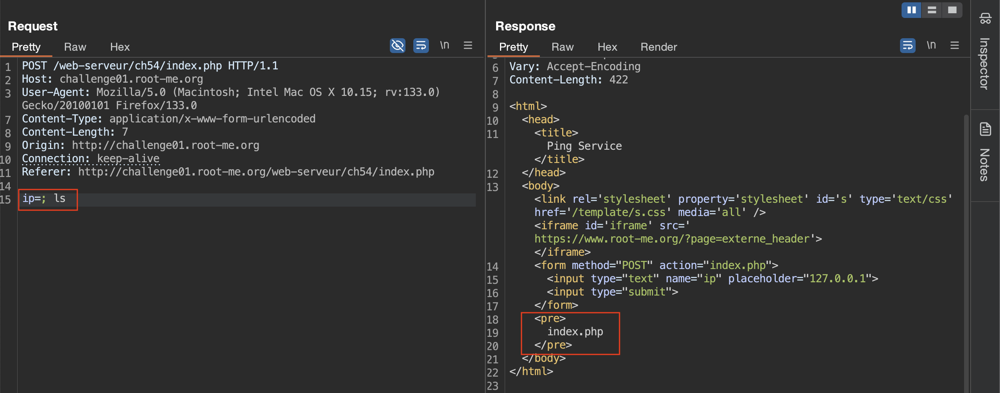
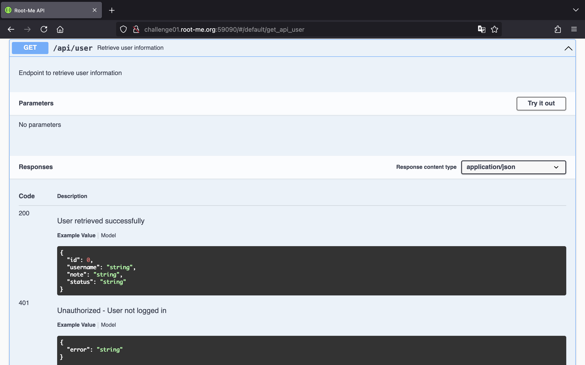
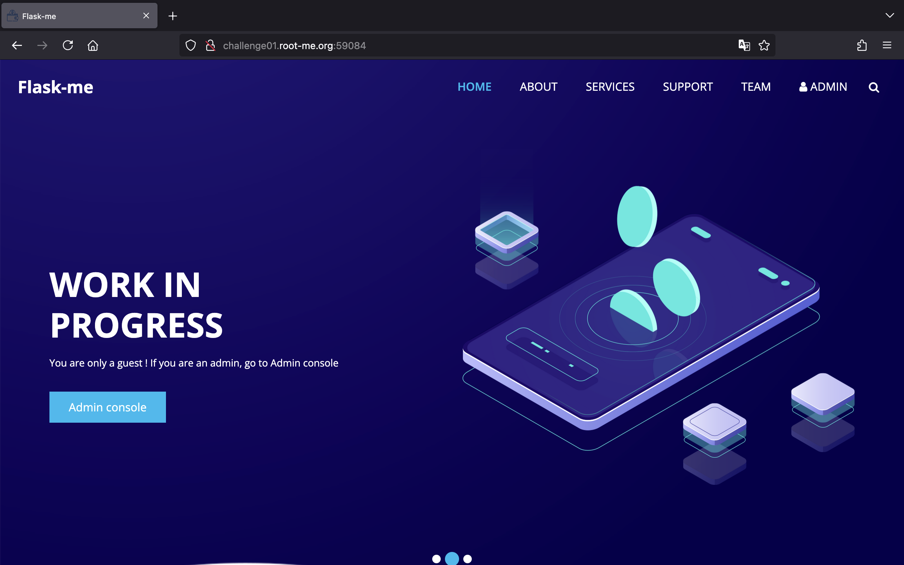
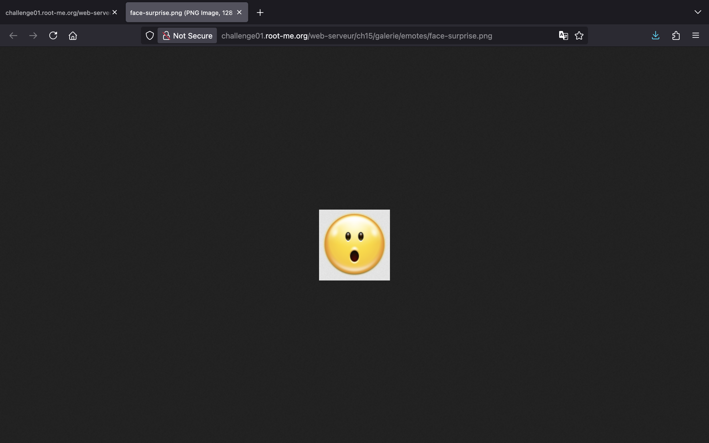

<!-- markdownlint-disable MD033 MD041 -->
<p align="center">
<a href="https://www.root-me.org/"></a>
</p>
<!-- markdownlint-enable MD033 -->

# Root Me

Chào mọi người!

Tại đây, mình sẽ viết lại cách mà mình đã thực hiện để có thể giải được một số thử thách ở trên trang web [Root Me](https://www.root-me.org/).

Cảm ơn vì đã ghé thăm! 🌱

## HTML - Source code

> Don't search too far

Mở đầu với một thử thách đơn giản, chúng ta sẽ nhấn tổ hợp phím `Command + U` trên Mac (hoặc `Ctrl + U` trên Windows) để có thể xem HTML source code của trang web. Từ đó, chúng ta sẽ lấy được password trong phần comment.


## HTTP - IP restriction bypass

> Only local users will be able to access the page
>
> Dear colleagues,
>
> We’re now managing connections to the intranet using private IP addresses, so it’s no longer necessary to login with a username / password when you are already connected to the internal company network.
>
> Regards,
>
> The network admin

Khi bắt đầu thử thách, chúng ta thấy trang web hiện lên thông báo rằng địa chỉ IP của chúng ta không thuộc mạng LAN và yêu cầu xác thực.


Tuy nhiên, sẽ ra sao nếu chúng ta giả mạo địa chỉ IP nội bộ bằng cách thêm vào một request header như `X-Forwarded-For: 192.168.0.1`.
Với trình duyệt Firefox, chúng ta có thể mở Web Developer Tools và sửa đổi request ở tab Network.

Gửi request, chúng ta thấy password xuất hiện.


## HTTP - Open redirect

> Internet is so big
>
> Find a way to make a redirection to a domain other than those showed on the web page.

Một trang web giản đơn với 3 nút Facebook, Twitter và Slack.


Nếu chúng ta nhấn chọn 1 trong 3 nút này sẽ được điều hướng tới trang web tương ứng. Bên dưới là request khi chúng ta nhấn vào nút Facebook.


Có thể thấy phần query string được thêm vào URL, nó có 2 tham số là `url` và `h`. Thực hiện điều hướng sử dụng `document.location`.

Điểm đáng chú ý là tham số `h` chứa giá trị MD5 hash của giá trị trong `url`. Chúng ta dễ dàng kiểm tra được nhờ sử dụng [Hash text - IT tools](https://it-tools.tech/hash-text).


Vậy, thử đổi `https://facebook.com` thành một giá trị bất kỳ, ví dụ như số `1`. Ngay lập tức, chúng ta nhận được một thông báo lỗi "Incorrect hash!".


Điều đó chứng tỏ rằng ở phía server đang thực hiện tính toán MD5 hash giá trị của tham số `url` và so sánh nó với hash nằm ở tham số `h`. Nếu đúng mới trả về thẻ `<script>`.

Vậy nên chúng ta cần tính giá trị MD5 hash của `1` để truyền vào tham số `h`.


Có lẽ server kiểm tra nếu giá trị của `url` không phải là 1 trong 3 URLs tới Facebook, Twitter, Slack và giá trị hash hợp lệ thì trả về flag cho chúng ta.


## HTTP - User-agent

> Admin is really dumb...

Trang web thông báo user-agent của chúng ta không phải là admin.


Do vậy, chúng ta chỉ cần sửa giá trị của header `User-Agent` thành `admin` và gửi request là có được password.


## Weak password

> Nothing too difficult

Trang web yêu cầu chúng ta đăng nhập.


Như tên thử thách, chúng ta có thể thử đăng nhập với tài khoản và mật khẩu dễ đoán. Tại đây, đăng nhập với `admin:admin` chúng ta được phép truy cập trang web.


## PHP - Command injection

> Ping service v1
>
> Find a vulnerabilty in this service and exploit it.
>
> You must manage to read index.php

Theo như tên của thử thách cùng với mô tả, chúng ta biết rằng trang web này dính lỗ hổng OS Command Injection và chúng ta cần đọc file `index.php`.

Trang web cho phép chúng ta nhập vào ip sau đó nó sẽ thực hiện câu lệnh `ping` tới ip đó.


Chúng ta có thể sử dụng [Burp Suite](https://portswigger.net/burp) để chỉnh sửa request cũng như quan sát response dễ dàng hơn.

Chúng ta sẽ dùng dấu `;` để thực thi được liên tiếp các lệnh. Với payload `; ls`, chúng ta xác định được có file `index.php` ở thư mục hiện tại.



Và để đọc nội dung của file `index.php`, chúng ta có thể dùng payload `; cat index.php`.


Vậy là flag ở trong file `.passwd`, chúng ta dùng payload `; cat .passwd` để lấy flag.


## API - Broken Access

> Follow the Swagger!
>
> Your friend has set up a platform where you can register and post a private note. Everything is based on an API. Before setting up the Front-End, he asked you to check that everything was secure.

Truy cập vào trang chủ, chúng ta thấy giao diện API Documentation được tạo ra bằng Swagger. Nó giúp chúng ta dễ dàng biết và sử dụng được các chức năng mà API cung cấp.


Trước tiên, tạo một tài khoản tại endpoint `/api/signup`.


Tạo tài khoản thành công, chúng ta thực hiện đăng nhập tại endpoint `/api/login`. Để ý được cấp cookie `session`, chúng ta sẽ dùng cookie này để có quyền truy cập vào 2 endpoints còn lại.


Tại endpoint `/api/note`, chúng ta có chức năng cập nhật note.


Và với endpoint cuối cùng `/api/user`, chúng ta xem được 3 thông tin là `note`, `userid` và `username`.

Tuy nhiên, điểm đáng chú ý tại endpoint này là `userid` có giá trị là `2`. Vậy người dùng với `userid` là `1` sẽ là ai?


Thông thường, chúng ta có thể xem thông tin người dùng theo id nên thử thêm `/1` vào endpoint `/api/user`.

Thành công, chúng ta đã xem được note chứa flag của người dùng `admin`.


## Backup file

> No clue.

Thử thách này yêu cầu chúng ta đăng nhập nhưng chúng ta đâu có biết thông tin đăng nhập.


Với tên thử thách liên quan đến backup file, có thể nghĩ đến việc đọc các file này để tìm được các thông tin hữu ích.

Chúng ta sẽ sử dụng công cụ [dirsearch](https://github.com/maurosoria/dirsearch) với wordlist [backup_files_only.txt](https://github.com/xajkep/wordlists/blob/master/discovery/backup_files_only.txt) để thực hiện fuzz tìm file backup.

```bash
python3 dirsearch.py -w ~/wordlists/backup_files_only.txt -u http://challenge01.root-me.org/web-serveur/ch11/
```

Sau khi thực hiện lệnh trên, chúng ta nhận thấy server có một file `index.php~`.

```text
[11:23:48] 200 -   843B - /web-serveur/ch11/index.php~
```

Tiếp theo, chúng ta sẽ lấy nội dung của file đó bằng lệnh `curl`.

```bash
curl http://challenge01.root-me.org/web-serveur/ch11/index.php~
```

```php
<?php

$username="ch11";
$password="OCCY9AcNm1tj";
...
```

Có được username cùng với password, chúng ta có thể đăng nhập thành công.


## HTTP - Directory indexing

> CTRL+U...

Khi truy cập trang web, chúng ta sẽ chẳng thấy gì. Tuy nhiên, nếu chúng ta xem HTML source của trang sẽ thấy một phần comment thú vị.


Theo đường dẫn tới file `pass.html` cũng không có password cho chúng ta.


Nhưng sẽ ra sao nếu chúng ta chỉ vào `admin`?

Bùm! Chúng ta thấy file và thư mục trong folder `admin`. Đáng chú ý là có một thư mục `backup`.


Và khi truy cập thư mục `backup`, chúng ta thấy có file `admin.txt`.


Cuối cùng, truy cập vào file `admin.txt`, chúng ta sẽ lấy được password.


## HTTP - Headers

> HTTP response give informations
>
> Get an administrator access to the webpage.

Truy cập vào thử thách, chúng ta thấy một dòng chữ bảo rằng nội dung của trang web không phải là phần duy nhất ở trong HTTP response:


Nếu chúng ta quan sát response trong Burp Suite sẽ thấy có header `Header-RootMe-Admin`:


Vậy, chúng ta sẽ thêm header đó vào trong request để nhận được password:


## HTTP - POST

> Do you know HTTP?
>
> Find a way to beat the top score!

Thử thách này yêu cầu chúng ta phải có score lớn hơn `999999` mới lấy được flag.


Khi nhấn "Give a try!", chúng ta sẽ có một score ngẫu nhiên nhỏ hơn `999999` và chúng ta thua.


Bên dưới là POST request khi chúng ta nhấn nút đó. Có thể thấy là score đang được truyền vào tham số `score`.


Vậy chúng ta có thể thay đổi giá trị của tham số `score` thành `1000000` và gửi lại request để lấy được flag.


## HTTP - Improper redirect

> Don’t trust your browser
>
> Get access to index.

Khi bắt đầu thử thách, chúng ta sẽ thấy giao diện trang web như sau:


Nó bắt chúng ta phải đăng nhập. Tuy nhiên, tên của thử thách liên quan tới redirect, có lẽ chúng ta đang được chuyển tới trang `login.php` từ `index.php`.

Vậy chúng ta có thể thực hiện lệnh `curl` tới `http://challenge01.root-me.org/web-serveur/ch32/` để không bị redirect. Từ đó có được flag:

```text
$ curl http://challenge01.root-me.org/web-serveur/ch32/
<html>
<body><link rel='stylesheet' property='stylesheet' id='s' type='text/css' href='/template/s.css' media='all' /><iframe id='iframe' src='https://www.root-me.org/?page=externe_header'></iframe>
<h1>Welcome !</h1>

<p>Yeah ! The redirection is OK, but without exit() after the header('Location: ...'), PHP just continue the execution and send the page content !...</p>
<p><a href="http://cwe.mitre.org/data/definitions/698.html">CWE-698: Execution After Redirect (EAR)</a></p>
<p>The flag is : ExecutionAfterRedirectIsBad
</p>
</body>
</html>

```

## HTTP - Verb tampering

> HTTP authentication
>
> Bypass the security establishment.

Ở thử thách này, trang web sử dụng Basic Authentication, yêu cầu chúng ta đăng nhập để có quyền truy cập.


Chúng ta có thể thử đăng nhập với `admin:admin` nhưng sẽ không thành công.


Tên thử thách cũng đã gợi ý là chúng ta cần thay đổi request method.

Ở đây, chúng ta sẽ sử dụng method `OPTIONS` để bypass thành công và nhận được password:


## Install files

> You know phpBB ?

Vào thử thách, chúng ta có một trang web trống trơn:


Xem HTML source code, chúng ta thấy có một đường dẫn `/web-serveur/ch6/phpbb`:


Truy cập vào `/web-serveur/ch6/phpbb` nhưng lại không có gì:


Sử dụng [dirsearch](https://github.com/maurosoria/dirsearch), chúng ta có thể tìm ra đường dẫn `/web-serveur/ch6/phpbb/install/`:

```text
$ python3 dirsearch.py -x 403 -u http://challenge01.root-me.org/web-serveur/ch6/phpbb

  _|. _ _  _  _  _ _|_    v0.4.3
 (_||| _) (/_(_|| (_| )

Extensions: php, asp, aspx, jsp, html, htm | HTTP method: GET | Threads: 25 | Wordlist size: 12266

Target: http://challenge01.root-me.org/

[10:38:09] Scanning: web-serveur/ch6/phpbb/
[10:40:25] 200 -   295B - /web-serveur/ch6/phpbb/index.html
[10:40:27] 301 -   162B - /web-serveur/ch6/phpbb/install  ->  http://challenge01.root-me.org/web-serveur/ch6/phpbb/install/
[10:40:27] 200 -   12KB - /web-serveur/ch6/phpbb/install/
CTRL+C detected: Pausing threads, please wait...

Task Completed
```

Truy cập vào `/web-serveur/ch6/phpbb/install/`, chúng ta có một file `install.php`:


Vào file `install.php`, chúng ta lụm được mật khẩu:


## Nginx - Alias Misconfiguration

> Off By Slash
>
> Our company’s web developer has finished developing the new intranet.\
> Mission: You must assess the security of this site before it goes live.


Thử thách này liên quan đến việc khai thác việc cấu hình sai Nginx alias dẫn đến lỗ hổng Path Traversal. Chúng ta có thể tìm kiếm được một số bài viết liên quan:

- <https://book.hacktricks.wiki/en/network-services-pentesting/pentesting-web/nginx.html#alias-lfi-misconfiguration>
- <https://www.acunetix.com/vulnerabilities/web/path-traversal-via-misconfigured-nginx-alias/>

Xem HTML source code, chúng ta thấy có phần comment đề cập tới `/assets/`:


Truy cập vào `/assets../`, chúng ta có thể xem được các files và thư mục:


Nhấn vào "flag.txt", chúng ta đọc được flag:


## API - Mass Assignment

> Anyway, I had no further use for it.
>
> Your friend thanks you for your previous vulnerability report, and assures you that this time he has removed the possibility of accessing notes, and has even created an administration role!

Vào URL của thử thách, chúng ta có giao diện API Documentation như sau:


API có 5 endpoints, chúng ta sẽ lần lượt xem qua chức năng ở từng endpoint.

Tại endpoint `/api/signup`, cho phép chúng ta tạo một người dùng với `username` và `password`:


Tại endpoint `/api/login`, thực hiện đăng nhập với thông tin tài khoản:


Tại endpoint `/api/user`, chúng ta có thể xem thông tin về người dùng:



Tại endpoint `/api/note`, cho phép cập nhật ghi chú của người dùng với nội dung ở tham số `note`:


Và ở endpoint `/api/flag`, cho phép lấy flag nếu chúng ta là admin:


Tiến hành khai thác, chúng ta sẽ đăng ký một người dùng có `username` là `foo` và `password` là `bar`:


Khi đăng nhập thành công, chúng ta được cấp một cookie `session` để có thể truy cập vào các endpoints còn lại:


Khi gửi GET request tới `/api/user`, nhận về kết quả chứa một số thông tin của người dùng, chúng ta sẽ chú ý tới `"status":"guest"`:


Thử chức năng cập nhật ghi chú, không có gì đặc biệt:


Truy cập vào `/api/flag`, chúng ta xác định cần phải là admin mới có thể lụm flag:


Quay trở lại endpoint `/api/user`, nếu chúng ta gửi request với method `OPTIONS` sẽ thấy server còn hỗ trợ thêm method `PUT`:


Chúng ta sẽ khai thác lỗ hổng Mass Assignment tại endpoint `/api/user` bằng cách thêm `{"status":"admin"}` vào request body, chú ý thêm header `Content-Type: application/json`:


Giờ, chúng ta sẽ lụm flag thành công nếu truy cập vào endpoint `/api/flag`:


## CRLF

> Inject false data in the journalisation log.

Vào thử thách, chúng ta có một trang web yêu cầu đăng nhập để xác thực và hiển thị nội dung log:


Đăng nhập thử `foo:bar`, chúng ta thấy thông báo người dùng đăng nhập được ghi vào log:


Như tên thử thách sẽ liên quan tới [CRLF Injection](https://book.hacktricks.wiki/en/pentesting-web/crlf-0d-0a.html#crlf-0d0a-injection), khai thác bằng cách chèn ký tự `%0D%0A` vào input để làm thay đổi log.

Cộng thêm việc trong log chúng ta thấy chuỗi "admin authenticated." nên hiểu rằng cần tạo một log như vậy để xác thực thành công. Chúng ta sẽ tiến hành khai thác bằng cách thêm `admin+authenticated.%0D%0Ahello` vào tham số `username` bởi giá trị của tham số này đang được ghi vào log:


## File upload - Double extensions

> Your goal is to hack this photo galery by uploading PHP code.\
> Retrieve the validation password in the file .passwd at the root of the application.

Vào thử thách, chúng ta có một trang web cho phép xem thư viện ảnh và tải lên ảnh:


Nhấn "upload" để hiển thị giao diện tải lên ảnh:


Chúng ta sẽ bắt đầu bằng cách tải lên một tấm ảnh thông thường:


Bên dưới là POST request để tải lên file, nếu chúng ta cố gắng tải lên PHP webshell với tên file `shell.php` sẽ nhận về thông báo "Wrong file extension !":


Do tên challenge đề cập tới sử dụng "Double extensions" nên chúng ta sử dụng tên file là `shell.php.png` sẽ bypass thành công:


Truy cập vào webshell, chúng ta đọc password với lệnh `cat ../../../.passwd`:


## File upload - MIME type

> Your goal is to hack this photo galery by uploading PHP code.\
> Retrieve the validation password in the file .passwd.

Chúng ta tiếp tục có một trang web cho phép xem ảnh và tải lên ảnh:


Nhấn vào "upload" để sử dụng tính năng tải lên ảnh:


Tiến hành tải lên một ảnh thông thường để lấy request:


Lấy lại request chúng ta tải file lên trước đó để khai thác. Do giá trị của header `Content-Type` đã là `image/png` nên chúng ta chỉ cần thay đổi tên file thành `shell.php` và nội dung:


Quay trở lại trình duyệt, chúng ta sẽ thấy các files vừa tải lên được hiển thị:


Thực hiện mở webshell ở một tab mới để thực thi lệnh, chúng ta dùng lệnh `cat ../../../.passwd` để đọc thành công password:


## Flask - Unsecure session

> Sign or unsign
>
> Flask-me’s web developer tells you that using a strong secret key is useless. Prove him wrong !



Truy cập vào "ADMIN", chúng ta được thông báo không phải là admin:


Kiểm tra thấy có một cookie `session`, chúng ta sẽ cần phải khai thác cookie này để trở thành admin:

```text
eyJhZG1pbiI6ImZhbHNlIiwidXNlcm5hbWUiOiJndWVzdCJ9.Z7-xXQ.7tUulKii5za8U9DQG0cuvqwlN1A
```


Do server sử dụng Flask nên chúng ta sẽ dùng công cụ [Flask Unsign](https://github.com/Paradoxis/Flask-Unsign) để khai thác. Trước tiên, cùng xem nội dung của session, chúng ta thấy `admin` mang giá trị `false`:

```text
$ flask-unsign -d -c "eyJhZG1pbiI6ImZhbHNlIiwidXNlcm5hbWUiOiJndWVzdCJ9.Z7-xXQ.7tUulKii5za8U9DQG0cuvqwlN1A"
{'admin': 'false', 'username': 'guest'}
```

Chúng ta cần secret để tạo một session mới với giá trị của `admin` là `true`. Tiếp theo, tiến hành brute-force để tìm ra secret `s3cr3t`:

```text
$ flask-unsign --wordlist ~/wordlists/jwt-secrets.txt --unsign -c "eyJhZG1pbiI6ImZhbHNlIiwidXNlcm5hbWUiOiJndWVzdCJ9.Z7-xXQ.7tUulKii5za8U9DQG0cuvqwlN1A" --no-literal-eval
[*] Session decodes to: {'admin': 'false', 'username': 'guest'}
[*] Starting brute-forcer with 8 threads..
[+] Found secret key after 2944 attemptsttyyyyuuuuii
b's3cr3t'
```

Đã có được secret, chúng ta sẽ sign một session mới với nội dung `{'admin': 'true', 'username': 'guest'}`:

```text
$ flask-unsign --sign -c "{'admin': 'true', 'username': 'guest'}" -S s3cr3t
eyJhZG1pbiI6InRydWUiLCJ1c2VybmFtZSI6Imd1ZXN0In0.Z7-yIw.8JQHLu-H3ABVht6lAIQzBQKTf08
```

Thay giá trị của cookie `session` thành chuỗi vừa tạo `eyJhZG1pbiI6InRydWUiLCJ1c2VybmFtZSI6Imd1ZXN0In0.Z7-yIw.8JQHLu-H3ABVht6lAIQzBQKTf08`, chúng ta reload trang web để thấy flag:


## GraphQL - Introspection

> The schema you will follow
>
> Take your first steps in exploring a GraphQL schema with the introspection feature!\
> Who knows, you might discover something...

Vào thử thách, chúng ta có một trang web như sau:


Khi nhấn "Search", chúng ta có một POST request tới `/rocketql` để thực hiện truy vấn GraphQL API lấy về kết quả:


Chúng ta sẽ tạo câu truy vấn introspection để lấy thông tin về schema:


Lấy kết quả trả về và đưa lên [GraphQL Visualizer](https://nathanrandal.com/graphql-visualizer/) để quan sát dễ dàng hơn, chúng ta tập trung vào truy vấn `IAmNotHere` có thể lấy ra dữ liệu từ trường `very_long_value` theo đối số nguyên `very_long_id`:


Vậy, chúng ta có thể viết đoạn script Python bên dưới để thử các số ở `very_long_id`:

```python
import requests

URL = "http://challenge01.root-me.org:59077/rocketql"

def solve():
    i = 1
    while True:
        try:
            query = {"query":f"{{ IAmNotHere (very_long_id: {i}) {{ very_long_value }} }}"}
            r = requests.post(url=URL, json=query)

            print(f"[+] i = {i} -> {r.json()}")
            i = i + 1

            if "flag" in r.json()["data"]["IAmNotHere"][0]["very_long_value"]:
                break
        except:
            pass


if __name__ == "__main__":
    solve()

```

Chạy đoạn script trên, chúng ta có thể lụm được flag:

```text
$ python3 solve.py
[+] i = 1 -> {'data': {'IAmNotHere': [{'very_long_value': 'n'}]}}
[+] i = 2 -> {'data': {'IAmNotHere': [{'very_long_value': 'o'}]}}
[+] i = 3 -> {'data': {'IAmNotHere': [{'very_long_value': 't'}]}}
[+] i = 4 -> {'data': {'IAmNotHere': [{'very_long_value': 'h'}]}}
[+] i = 5 -> {'data': {'IAmNotHere': [{'very_long_value': 'i'}]}}
[+] i = 6 -> {'data': {'IAmNotHere': [{'very_long_value': 'n'}]}}
[+] i = 7 -> {'data': {'IAmNotHere': [{'very_long_value': 'g'}]}}
[+] i = 8 -> {'data': {'IAmNotHere': [{'very_long_value': 'h'}]}}
[+] i = 9 -> {'data': {'IAmNotHere': [{'very_long_value': 'e'}]}}
[+] i = 10 -> {'data': {'IAmNotHere': [{'very_long_value': 'r'}]}}
[+] i = 11 -> {'data': {'IAmNotHere': [{'very_long_value': 'e'}]}}
[+] i = 12 -> {'data': {'IAmNotHere': [{'very_long_value': 'l'}]}}
[+] i = 13 -> {'data': {'IAmNotHere': [{'very_long_value': 'o'}]}}
[+] i = 14 -> {'data': {'IAmNotHere': [{'very_long_value': 'l'}]}}
[+] i = 15 -> {'data': {'IAmNotHere': []}}
[+] i = 16 -> {'data': {'IAmNotHere': []}}
[+] i = 17 -> {'data': {'IAmNotHere': [{'very_long_value': 'Congratulations, you can use this flag: RM{1ntr0sp3ct1On_1s_us3ful}'}]}}
```

## HTTP - Cookies

> Bob created a PHP script to gather user emails
>
> PS: Bob really love cookies!

Vào thử thách, chúng ta có trang web cho phép nhập địa chỉ email:


Nếu nhấn "Saved email adresses", thông báo "You need to be admin" được hiển thị. Từ đó, chúng ta hiểu rằng cần phải trở thành admin:


Kiểm tra cookies, chúng ta thấy có cookie `ch7` mang giá trị `visiteur`:


Vậy chỉnh sửa `visiteur` thành `admin`:


Reload trang web, chúng ta lụm thành công password:


## Insecure Code Management

> Protect your code management server?
>
> Get the password (in clear text) from the admin account.


Nếu chúng ta thực hiện fuzzing sẽ thấy server có một thư mục `.git`:


Sử dụng công cụ [git-dumper](https://github.com/arthaud/git-dumper) để tải hết các files và thư mục về lưu vào `test`:

```text
$ git-dumper http://challenge01.root-me.org/web-serveur/ch61/ test
...
$ cd test
```

Tại thư mục `test`, chúng ta sử dụng lệnh `git reflog` để xem lịch sử commits:

```text
$ git reflog
c0b4661 (HEAD -> master) HEAD@{0}: commit: blue team want sha256!!!!!!!!!
550880c HEAD@{1}: commit: renamed app name
a8673b2 HEAD@{2}: commit: changed password
1572c85 HEAD@{3}: commit: secure auth with md5
5e0e146 HEAD@{4}: commit (initial): Initial commit for the new HR database access
```

Dùng lệnh `git diff a8673b2` để xem sự thay đổi ở commit, chúng ta tìm được password là `s3cureP@ssw0rd`:

```text
$ git diff a8673b2
diff --git a/config.php b/config.php
index e11aad2..663fe35 100644
--- a/config.php
+++ b/config.php
@@ -1,3 +1,3 @@
 <?php
        $username = "admin";
-       $password = "s3cureP@ssw0rd";
+       $password = "0c25a741349bfdcc1e579c8cd4a931fca66bdb49b9f042c4d92ae1bfa3176d8c";
```

## JWT - Introduction

> Secure token exchange
>
> To validate the challenge, connect as admin.

Vào thử thách, chúng ta có một trang web cho phép đăng nhập như sau:


Khi nhấn "Login as Guest!", chúng ta đăng nhập thành công với người dùng `guest`:


Chúng ta được cấp một cookie `jwt` chứa chuỗi JWT có trường `username` là `guest`:


Chúng ta sẽ khai thác sử dụng None Algorithm. Trước tiên, đổi giá trị của `alg` trong header của JWT thành `none`:


Giờ ở trong phần payload của JWT, chúng ta đổi `guest` thành `admin`:


Xoá bỏ đi phần signature và gửi lại request, chúng ta sẽ thấy được flag:


## XSS - Server Side

> Who said XSS was only for the client side?
> This platform for issuing certificates of participation has just gone live. The developers assure you that they have followed best practices and escaped all user inputs before using them in their code...
>
> The flag is located in the `/flag.txt` file.

Vào thử thách, chúng ta có trang web như sau:


Chúng ta sẽ thực hiện đăng ký tài khoản và đăng nhập để kiểm tra tại trường nào dính lỗ hổng XSS:


Tại giao diện bên trên, nhập thử "hello" và nhấn "Generate", chúng ta nhận được một file PDF, giá trị ở trường "First name" và "Last name" đã thành chữ đậm. Do đó, tại 2 trường này chúng ta có thể khai thác XSS:


Tìm kiếm Google về khai thác server-side XSS, chúng ta có thể thấy bài viết <https://fluidattacks.com/advisories/relsb/> kèm payload:


Tiến hành khai thác, chúng ta tạo một tài khoản mới và có thể nhập payload dưới vào trường "First name":

```html
<script>xhr = new XMLHttpRequest;  xhr.onload=function(){document.write((this.responseText))};  xhr.open("GET","file:///flag.txt");  xhr.send();</script>
```


Cuối cùng, đăng nhập để tạo file PDF, chúng ta thấy đọc được nội dung của file `/flag.txt`:


## Directory traversal

> Photo gallery v 0.01
>
> Find the hidden section of the photo galery.

Vào thử thách, chúng ta thấy nó cho phép xem ảnh được phân loại theo danh mục:


Khi nhấn vào một danh mục nào đấy, ví dụ như "categories" thì chuỗi đó sẽ được truyền tới tham số `galerie`:


Chúng ta thử bỏ giá trị của tham số `galerie` sẽ thấy xuất hiện thêm một mục `86hwnX2r`:


Giờ thêm chuỗi `86hwnX2r` vào tham số `galerie` sẽ thấy xuất hiện file `password.txt`:


Tuy nhiên, nếu chúng ta thêm `86hwnX2r/password.txt` vào tham số `galerie` sẽ không đọc được mật khẩu do server chỉ đang mở thư mục với hàm `opendir()`:


Quay trở lại và mở một hình ảnh bất kỳ trên một tab mới, chúng ta thấy URL có dạng `http://challenge01.root-me.org/web-serveur/ch15/galerie/emotes/face-surprise.png`:



Do đó, chúng ta truy cập vào `http://challenge01.root-me.org/web-serveur/ch15/galerie/86hwnX2r/password.txt` sẽ lấy mật khẩu thành công:


